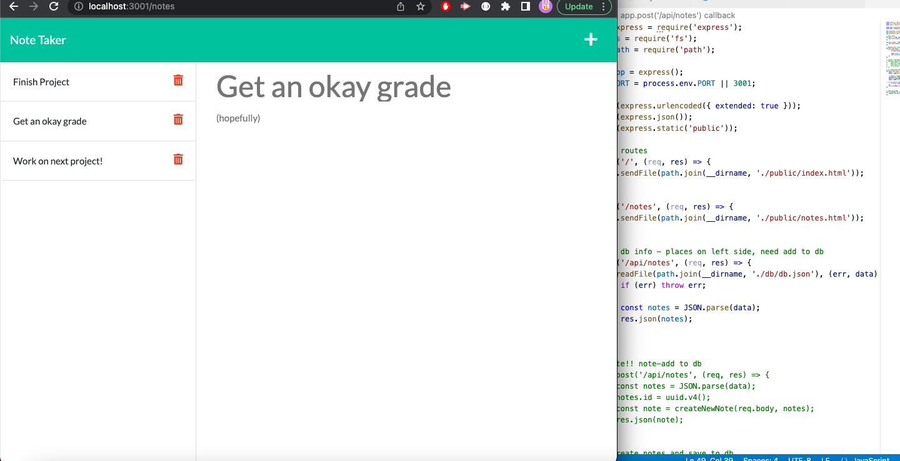

# Note Taker

## Description

This project is a simple application that allows users to keep track of their notes or to-do's using GET and POST methods to retrieve from and store to a database. 

## Problems

For this project I had difficulty with the POST method specifically. For most of the code I was able to follow along with the module and apply what I learned from there. However, when attempting the POST method I had to do a little more digging. I ended up using a hodge podge of code that has room for improvement but works nonetheless.

## Improvements

If I had more time I would like to work on my POST request more. When saving a note to the database it does not save as a true array, also when clicking on the notes to look over them again for some reason the first note just brings the user back to the 'Note text' screen.

I also of course would have liked to work on the DELETE method for deleting notes but given we have been learning it in the next module I am hopeful to become more familiar with the method soon enough.

### Click [here](https://fathomless-fortress-53272.herokuapp.com) to view the deployed application on Heroku!